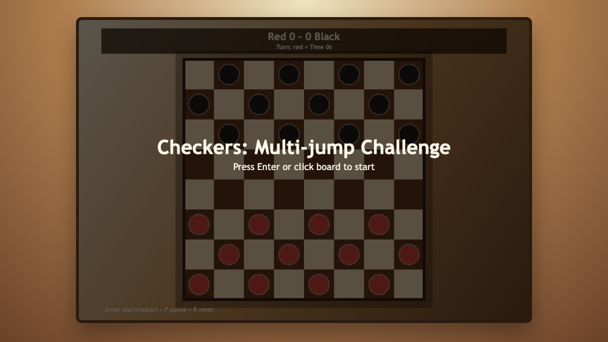
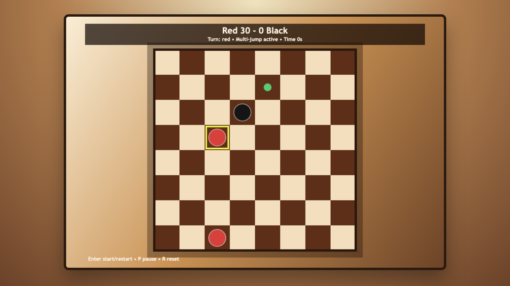
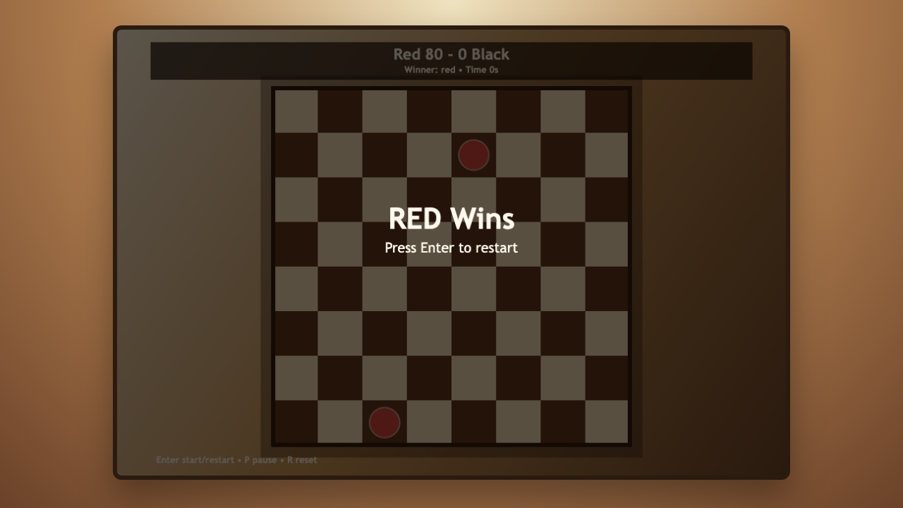

# daily-classic-game-2026-03-13-checkers-multi-jump-challenge

<div align="center">
  <p><strong>Deterministic digital checkers with a Multi-jump challenge twist that rewards chained captures and keeps tactical tempo high.</strong></p>
</div>

<div align="center">
  
  <br />
  
  <br />
  
</div>

## Quick Start

```bash
pnpm install
pnpm dev
```

## How To Play

- Press `Enter` or click the board to start.
- Click a piece, then click a highlighted destination square to move.
- Press `P` to pause/resume.
- Press `R` to reset to a fresh opening board.

## Rules

- Standard 8x8 checkers movement/capture flow on dark squares.
- Captures are mandatory when available.
- A capture chain must continue with the same piece when another jump is possible.
- Pieces that reach the back rank are promoted to kings.

## Scoring

- Simple move: `5` points.
- Single capture: `30` points.
- Additional captures in the same chain: escalating bonus (`+50`, then +20 per extra link).
- Win condition: remove all opposing pieces.

## Twist

- **Multi-jump challenge**: each chained capture with the same piece grants escalating combo points and keeps the turn locked until the chain is exhausted.

## Verification

- `pnpm test`
- `pnpm build`
- `pnpm capture`
- Browser automation hooks:
  - `window.advanceTime(ms)`
  - `window.render_game_to_text()`

## Project Layout

- `src/game-core.js`: deterministic board state, move legality, capture chaining, scoring, pause/reset.
- `src/main.js`: canvas renderer, pointer/keyboard input, and browser hook wiring.
- `src/styles.css`: responsive board-shell visuals.
- `tests/game-core.test.mjs`: deterministic rules and lifecycle tests.
- `tests/capture.spec.mjs`: Playwright screenshot + text-state capture.

## GIF Captures

- `clip-opening-setup.gif`: opening board and first tactical shape.
- `clip-double-jump-chain.gif`: forced chain capture with combo scoring.
- `clip-king-promotion-race.gif`: late-board king conversion pressure.
